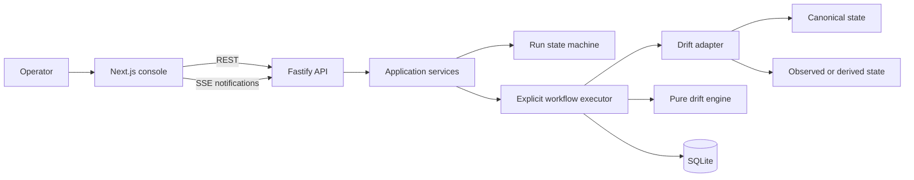

# Project Plan

## 1. Delivery strategy

Build a thin, evaluator-ready vertical slice while preserving clear control-plane boundaries.

The implementation order is:

```text
foundation
→ deterministic domain
→ persisted workflow
→ minimal operator UI
→ live progress
→ approval and reconciliation
→ documentation drift
→ failure hardening
→ submission polish
```

The first usable milestone should appear early:

```text
seeded scenario
→ Run drift scan
→ persisted execution
→ run-detail API
→ one-page UI
→ visible findings
```

SSE, reconciliation, and secondary adapters follow after this path works.

## 2. Target architecture



## 3. Core domain

### Run statuses

```text
queued
running
awaiting_approval
succeeded
failed
rejected
```

### Step statuses

```text
pending
running
succeeded
failed
skipped
```

### Primary workflow steps

```text
validate_canonical_state
load_observed_state
normalize_state
calculate_drift
classify_findings
build_remediation_plan
```

### Reconciliation steps

```text
preflight_reconciliation
apply_reconciliation
verify_convergence
```

### Failure transition

```text
any active step → failed
remaining pending steps → skipped
```

## 4. Adapter model

Keep the interface minimal.

```ts
interface DriftAdapter {
  readonly kind: string;

  loadCanonical(environment: Environment): Promise<unknown>;
  loadObserved(environment: Environment): Promise<unknown>;

  normalizeCanonical(input: unknown): NormalizedState;
  normalizeObserved(input: unknown): NormalizedState;

  buildTarget(
    canonical: NormalizedState,
    observed: NormalizedState,
  ): NormalizedState;

  applyTarget(
    environment: Environment,
    expectedObservedDigest: string,
    target: NormalizedState,
  ): Promise<ApplyResult>;
}
```

The pure drift engine compares normalized states. The adapter owns parsing, managed fields, and target serialization.

## 5. Scenarios

### Scenario A — Service configuration drift

Desired:

```yaml
resources:
  - id: api-service
    type: service
    desired:
      image: api:v2
      replicas: 3
      environment:
        LOG_LEVEL: info
```

Observed:

```json
{
  "api-service": {
    "type": "service",
    "image": "api:v1",
    "replicas": 1,
    "environment": {
      "LOG_LEVEL": "debug"
    },
    "runtimePid": 1832
  }
}
```

Expected findings:

- `/image`: changed, critical;
- `/replicas`: changed, warning;
- `/environment/LOG_LEVEL`: changed, warning.

`runtimePid` is ignored because the adapter does not own it.

### Scenario B — Documentation drift

Canonical schema:

```yaml
properties:
  retries:
    type: integer
    default: 3
  timeout:
    type: integer
    default: 30
```

Managed Markdown table:

```markdown
| Setting | Type | Default |
|---|---|---|
| retries | integer | 5 |
```

Expected findings:

- `retries.default`: changed from `5` to `3`;
- `timeout`: missing from documentation.

The generated remediation target updates the managed table or generated block.

### Failure scenarios

- invalid canonical YAML/schema;
- malformed observed JSON;
- stale plan after observed state changes;
- simulated atomic-write failure;
- verification mismatch.

## 6. Data model

### Environments

- `id`
- `name`
- `adapter_kind`
- server-controlled source configuration
- timestamps

### Runs

- `id`
- `environment_id`
- `status`
- `current_step`
- `version`
- canonical digest
- observed digest
- finding count
- error envelope
- timestamps

### Steps

- `run_id`
- stable step key
- sequence
- status
- message
- structured output
- structured error
- timestamps

### Findings

- resource ID
- path
- kind
- severity
- canonical value
- observed value
- sequence

### Plans

- run ID
- canonical digest
- expected observed digest
- target representation
- engine version
- created timestamp

### Decisions

- run ID
- approved/rejected
- actor
- comment
- timestamp

### Events

- monotonic ID
- run ID
- event type
- payload
- timestamp

## 7. API surface

### Environments

```http
GET  /api/environments                          ✅ implemented
GET  /api/environments/:environmentId           ❌ not implemented (narrow slice)
POST /api/environments/:environmentId/reset     ✅ implemented
GET  /api/environments/:environmentId/runs      ❌ not implemented (narrow slice)
```

### Runs

```http
POST /api/environments/:environmentId/runs
GET  /api/runs/:runId
GET  /api/runs/:runId/events
POST /api/runs/:runId/approve
POST /api/runs/:runId/reject
```

The run-detail endpoint returns the complete snapshot:

- run;
- ordered steps;
- findings;
- evidence;
- plan;
- decision;
- recent events.

## 8. UI layout

```text
┌─────────────────────────────────────────────────────────────┐
│ Config Drift Guard                         Scenario ▼       │
├───────────────────────┬─────────────────────────────────────┤
│ Environment           │ Current run                         │
│ Adapter               │ Status                              │
│ Canonical source      │ Workflow timeline                   │
│ Observed source       │                                     │
│ [Run drift scan]      │                                     │
│ [Reset scenario]      │                                     │
├───────────────────────┴─────────────────────────────────────┤
│ Findings                                                   │
│ grouped by resource / documentation entry                  │
├─────────────────────────────────────────────────────────────┤
│ Evidence                                                    │
│ canonical digest · observed digest · engine version         │
├─────────────────────────────────────────────────────────────┤
│ Remediation plan                                            │
│ [Reject]                              [Approve reconcile]   │
├─────────────────────────────────────────────────────────────┤
│ Event log · Recent runs                                     │
└─────────────────────────────────────────────────────────────┘
```

Use native controls and restrained styling. The experience should be operational, not decorative.

## 9. Milestones

### Milestone 0 — Repository assessment

- inspect repository state;
- confirm package manager and scaffold;
- compare actual state against docs;
- record QART analysis;
- make no code changes.

**Exit:** implementation sequence confirmed.

### Milestone 1 — Workspace foundation — LANDED

**Commit:** `chore: initialize TypeScript workspace and development tooling` (sha `5cf81ae`)

- pnpm workspace;
- Fastify API;
- Next.js web app;
- contracts package;
- drift-engine package;
- TypeScript strict mode;
- Biome;
- Vitest;
- root scripts;
- health endpoint;
- basic connectivity page.

**Exit:** `pnpm check` passes and both services start.

### Milestone 2 — Persistence and contracts — LANDED

**Commit:** `feat: define shared contracts and SQLite persistence` (sha `9f18cfa`)

- SQLite and Drizzle;
- migrations;
- environments, runs, steps, findings, plans, decisions, events;
- shared Zod schemas;
- seeded environment metadata;
- repository tests.

**Exit:** repository state round-trips correctly and local DB is reproducible.

### Milestone 3 — Pure drift engine — LANDED

**Commit:** `feat: implement deterministic configuration drift engine` (sha `aee5686`)

- normalized-state model;
- deterministic recursive comparison;
- managed-field semantics;
- severity policy;
- target generation;
- digests;
- comprehensive unit tests.

**Exit:** service scenario emits exactly three expected findings.

### Milestone 4 — First end-to-end slice — LANDED

**Commit:** `feat: execute and display persisted drift scans` (sha `904a2e3`)

- local service-config adapter;
- run state machine;
- explicit executor;
- persisted steps;
- start-run API;
- run-detail API;
- one-page UI;
- final findings display.

Synchronous or simple in-process background execution is acceptable.

**Exit:** evaluator can run a scan from the browser and refresh without losing state.

### Milestone 5 — Live progress — LANDED

**Commit:** `feat: stream workflow progress with server-sent events` (sha `d9c8c27`)

- persisted events;
- minimal SSE;
- client refetch on events;
- workflow timeline;
- event log;
- reconnect/reload correctness.

**Exit:** progress is visible without client-side state-machine duplication.

### Milestone 6 — Approval and reconciliation — LANDED

**Commit:** `feat: add approval-gated reconciliation and verification` (sha `804191b`)

- immutable plan;
- approval/rejection;
- stale digest guard;
- atomic replacement;
- verification scan;
- UI controls.

**Exit:** approved service drift converges; rejected runs remain terminal.

### Milestone 7 — Documentation drift — LANDED

**Commit:** `feat: detect structured documentation drift` (sha `e83fc19`)

- schema-to-Markdown-table adapter or managed generated block;
- second seeded environment;
- structured findings;
- deterministic target generation;
- adapter tests;
- shared UI presentation.

**Exit:** the same workflow detects and can reconcile documentation drift.

### Milestone 8 — Failure hardening — LANDED

**Commit:** `test: cover workflow transitions and failure scenarios` (sha `76a87e8`)

- invalid canonical state;
- malformed observed state;
- stale plan;
- simulated write failure;
- verification failure;
- restart recovery;
- complete state-transition tests.

**Exit:** failures are attached to the correct step, no unsafe mutation occurs, and pending steps are skipped.

### Milestone 9 — Documentation and submission — LANDED

**Commit:** `docs: finalize architecture, trade-offs, and AI usage` (sha `8cecfe0`)

- README reconciled to actual behavior;
- architecture document;
- decisions;
- trade-offs;
- current understanding;
- demo walkthrough;
- AI interaction log with commit SHAs;
- clean setup verification.

**Exit:** fresh-clone instructions work and no aspirational claims remain.

### Milestone 10 — Final review

- run full checks;
- manually test happy path and one failure;
- inspect for unnecessary abstractions;
- audit git history;
- remove dead code;
- reconcile docs.

**Commit only if justified:** `refactor: simplify orchestration after end-to-end review`

## 10. Timebox priority

### P0

- one complete service-config workflow;
- persistence;
- UI;
- findings;
- approval/reconciliation;
- verification;
- tests;
- README;
- AI log.

### P1

- SSE;
- evidence panel;
- stale-plan protection;
- two or three deterministic failures.

### P2

- documentation-drift adapter;
- recent run history;
- polished event log.

### P3

- screenshots/GIF;
- CLI;
- optional AI explanation;
- additional adapters.

If the timebox becomes constrained, cut P2/P3 before weakening P0 correctness.

## 11. Testing matrix

| Area | Cases |
|---|---|
| Validation | malformed YAML/JSON, duplicate IDs, invalid types |
| Normalization | key order, default maps, unmanaged fields |
| Comparison | added, removed, changed, nested values |
| State machine | every legal and illegal transition |
| Persistence | ordering, uniqueness, JSON validation |
| Workflow | no drift, drift, failure, interrupted run |
| Approval | approve, reject, repeat, contradiction |
| Reconciliation | stale plan, atomic failure, convergence |
| SSE | replay, reconnect, cleanup, terminal event |
| Documentation | missing row, changed default, deterministic generation |

## 12. Security and correctness constraints

- bind API to loopback by default;
- never accept filesystem paths from browser input;
- no shell execution;
- strict schema validation;
- reject duplicate resource IDs;
- compare only managed fields;
- use content digests;
- immutable plans;
- atomic writes;
- operator approval;
- verification after mutation;
- structured errors;
- REST snapshot as source of truth.

## 13. Definition of done

The project is complete when:

- setup works from a fresh clone;
- the browser starts a real persisted run;
- each step is visible;
- findings are deterministic;
- evidence and source digests are visible;
- the browser cannot author arbitrary remediation;
- approval is enforced;
- stale plans fail;
- reconciliation is atomic;
- verification proves convergence;
- failure scenarios are understandable;
- tests and production build pass;
- docs describe only implemented behavior;
- git history shows deliberate increments;
- complete AI interactions and author decisions are preserved.
